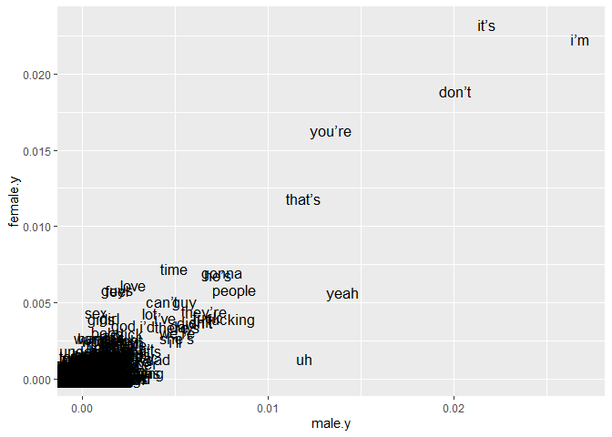
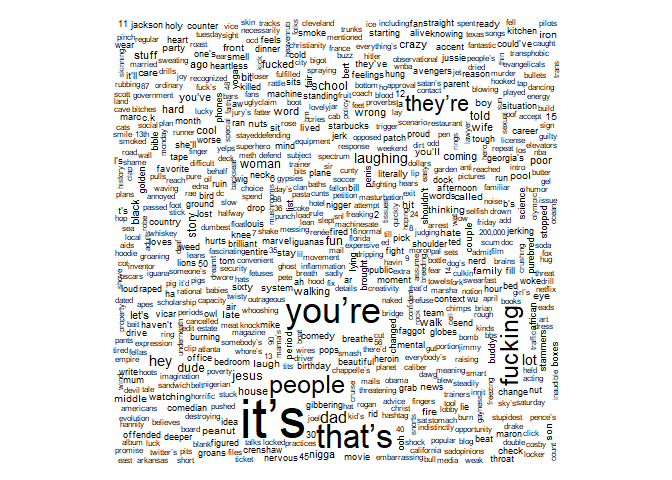
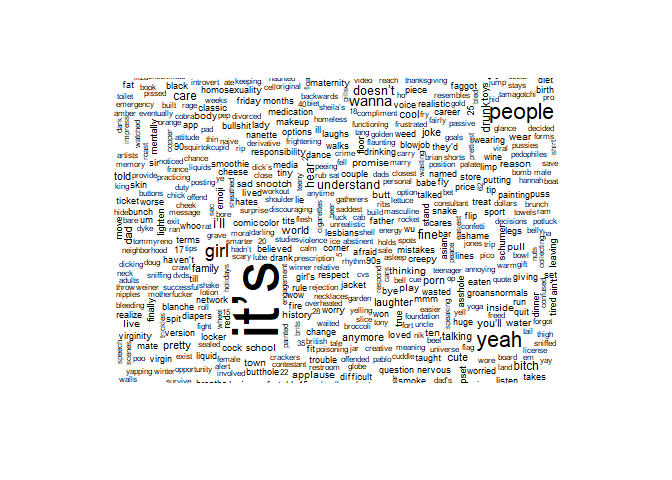
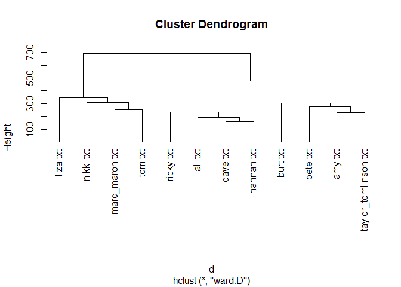
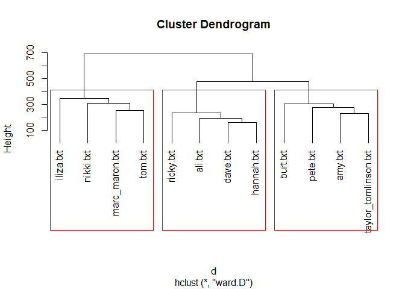
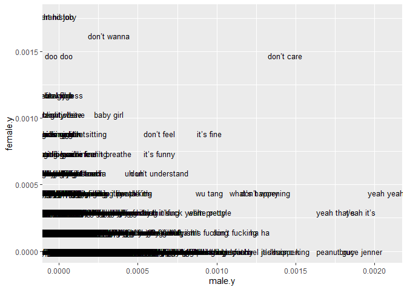
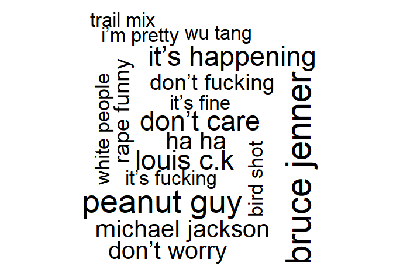
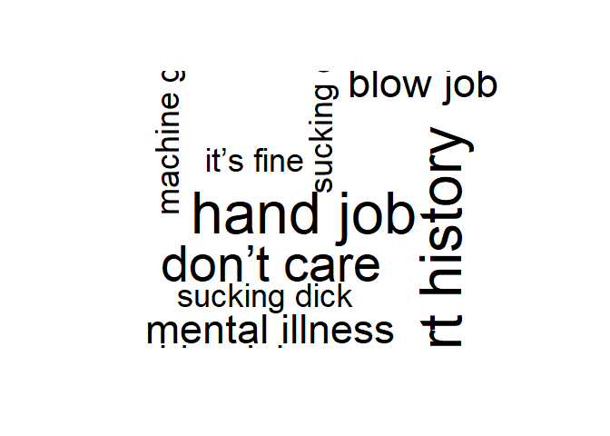

Standup NLP
================
David DeStephano
March 28, 2020

``` r
library(tidyverse)
library(tidytext)
library(stringr)
library(SnowballC)
```

Inspired by these projects, one comparing gender deifferences between commencement speeches, and the other compariring standup specials

<https://towardsdatascience.com/using-nlp-to-explore-leadership-inspiration-f2e0b805d01c>

<https://medium.com/nwamaka-imasogie/stand-up-comedy-and-nlp-c7d64002520c>

Lets pick 5 mens and 5 womens specials from the last 10 years from the most popular stand up specials on [IMDB](https://www.imdb.com/search/title/?title_type=tv_special&genres=comedy&explore=title_type,genres) with no repeating comedians. Was not sure if I should include Hannah Gadsby: [Nanette](https://scrapsfromtheloft.com/2018/07/21/hannah-gadsby-nanette-transcript/) or not because it is too serious

Men:

<https://scrapsfromtheloft.com/2020/03/21/bert-kreischer-hey-big-boy-transcript/>

<https://scrapsfromtheloft.com/2020/03/12/marc-maron-end-times-fun-transcript/>

<https://scrapsfromtheloft.com/2020/03/01/pete-davidson-alive-from-new-york-transcript/>

<https://scrapsfromtheloft.com/2019/08/26/dave-chappelle-sticks-stones-transcript/>

<https://scrapsfromtheloft.com/2018/03/15/ricky-gervais-humanity-transcript/>

<https://scrapsfromtheloft.com/2020/03/25/tom-segura-ball-hog-transcript/>

Women: <https://scrapsfromtheloft.com/2018/09/13/iliza-shlesinger-war-paint-transcript/>

<https://scrapsfromtheloft.com/2018/07/21/hannah-gadsby-nanette-transcript/>

<https://scrapsfromtheloft.com/2018/05/15/ali-wong-hard-knock-wife-full-transcript/>

<https://scrapsfromtheloft.com/2017/06/20/amy-schumer-leather-special-2017-full-transcript/>

<https://scrapsfromtheloft.com/2019/10/04/nikki-glaser-bangin-transcript/>

What's her name's netflix transcript pulled from web tools

``` r
standup <- data_frame(file = paste0("C:\\Users\\daved\\Documents\\Advanced analytic techniques\\Lab 2\\standup_NLP\\up\\",
                                        c("taylor_tomlinson.txt","ali.txt","amy.txt", "burt.txt", "dave.txt", "hannah.txt", "iliza.txt", "marc_maron.txt", "nikki.txt", "pete.txt", "ricky.txt", "tom.txt"))) %>%
  mutate(text = map(file, read_lines)) %>%
  unnest() %>%
  group_by(file = str_sub(basename(file), 1, -5)) %>%
  mutate(line_number = row_number()) %>%
  ungroup() %>%
  unnest_tokens(word, text) %>%
  anti_join(stop_words) 
#%>%mutate(word = wordStem(word)) 


head(standup) %>% knitr::kable()
```

| file              |  line\_number| word      |
|:------------------|-------------:|:----------|
| taylor\_tomlinson |             1| love      |
| taylor\_tomlinson |             1| dead      |
| taylor\_tomlinson |             3| beginners |
| taylor\_tomlinson |             3| plays     |
| taylor\_tomlinson |             6| darling   |
| taylor\_tomlinson |             8| hey       |

``` r
##seperate into men and women?
standup2 <- standup %>% 
  mutate(gender=ifelse(file=="burt"|file=="dave"|file=="marc_maron"|file=="pete"|file=="ricky"|file=="tom", "male", "female"))

## count each word per speech 

pw <- standup2[,c("gender","word")]
d<-  count_(pw, c("gender", "word"))

## make a document term matrix ##

pwdtm <- d %>%
  cast_dtm(gender, word, n)

## make the dtm into a dataframe ##

mpwdtm<-as.matrix(pwdtm)
df.mpwdtm<-as.data.frame(mpwdtm)

## make the dtm into a tdm instead ##

t.t <- t(mpwdtm)
head(t.t, 50)
```

    ##        Docs
    ## Terms   female male
    ##   0.80       1    0
    ##   00         6    8
    ##   1,000      1    0
    ##   10         3    0
    ##   1000       1    0
    ##   101        1    0
    ##   11         2    6
    ##   11th       1    0
    ##   12         4   14
    ##   12.50      1    0
    ##   127        1    0
    ##   1300s      1    0
    ##   14         1    2
    ##   140        1    1
    ##   15         3   17
    ##   17         6    0
    ##   18         3    0
    ##   1937       1    0
    ##   1989       1    0
    ##   1997       2    0
    ##   2          2    5
    ##   2.0        1    0
    ##   20         3    9
    ##   200        1    0
    ##   2001       1    0
    ##   20s        9    0
    ##   21         1    0
    ##   21st       1    0
    ##   22         2    1
    ##   24         1    2
    ##   25         5    1
    ##   27         3    0
    ##   28         2    1
    ##   30         2    7
    ##   300        1    1
    ##   35         2    4
    ##   40         2    2
    ##   401k       1    0
    ##   42         1    0
    ##   45         5    5
    ##   48         1    2
    ##   49         1    0
    ##   5          3    1
    ##   50         1    6
    ##   501s       1    0
    ##   556        1    0
    ##   6          1    7
    ##   60         1    0
    ##   62         2    0
    ##   7          1    3

``` r
df.t.t <- as.data.frame(t.t)

summing <- function(x) x/sum(x, na.rm=T)

df.t.t.2 <- apply(df.t.t, 2, summing)

df.t.t$names<-rownames(df.t.t)
df.t.t <- as.data.frame(t.t)
df.t.t$names<-rownames(df.t.t)
head(df.t.t)
```

    ##       female male names
    ## 0.80       1    0  0.80
    ## 00         6    8    00
    ## 1,000      1    0 1,000
    ## 10         3    0    10
    ## 1000       1    0  1000
    ## 101        1    0   101

``` r
df.t.t.2 <- as.data.frame(df.t.t.2)
df.t.t.2$names<-rownames(df.t.t.2)
df.t.t.2 <- as.data.frame(df.t.t.2)

total <- merge(df.t.t,df.t.t.2,by="names")

head(total)
```

    ##   names female.x male.x     female.y       male.y
    ## 1  0.80        1      0 5.661232e-05 0.000000e+00
    ## 2    00        6      8 3.396739e-04 4.098571e-04
    ## 3    05        0      1 0.000000e+00 5.123213e-05
    ## 4 1,000        1      0 5.661232e-05 0.000000e+00
    ## 5  1.50        0      1 0.000000e+00 5.123213e-05
    ## 6    10        3      0 1.698370e-04 0.000000e+00

What are the most female words vs male?
=======================================

``` r
total$male.over.female = (total$male.y) - (total$female.y)
sort.OT <- total[order(total$male.over.female) , ]
sort.OT[1:30, ]
```

    ##           names female.x male.x    female.y       male.y male.over.female
    ## 2936       guys      104     37 0.005887681 1.895589e-03     -0.003992092
    ## 2417       feel      102     36 0.005774457 1.844357e-03     -0.003930100
    ## 5680        sex       77     14 0.004359149 7.172499e-04     -0.003641899
    ## 3850       love      109     53 0.006170743 2.715303e-03     -0.003455440
    ## 2769      girls       70     20 0.003962862 1.024643e-03     -0.002938220
    ## 7222     you’re      288    261 0.016304348 1.337159e-02     -0.002932761
    ## 2763       girl       71     28 0.004019475 1.434500e-03     -0.002584975
    ## 6584       time      128     96 0.007246377 4.918285e-03     -0.002328092
    ## 2965       hand       48     12 0.002717391 6.147856e-04     -0.002102606
    ## 6966      wanna       48     14 0.002717391 7.172499e-04     -0.002000141
    ## 487        baby       54     26 0.003057065 1.332035e-03     -0.001725030
    ## 3464       it’s      411    425 0.023267663 2.177366e-02     -0.001494007
    ## 730        blow       30      4 0.001698370 2.049285e-04     -0.001493441
    ## 6478    tension       26      1 0.001471920 5.123213e-05     -0.001420688
    ## 401         art       25      2 0.001415308 1.024643e-04     -0.001312844
    ## 3512        job       44     23 0.002490942 1.178339e-03     -0.001312603
    ## 3727    lesbian       24      1 0.001358696 5.123213e-05     -0.001307464
    ## 2465       fine       38     17 0.002151268 8.709463e-04     -0.001280322
    ## 7136      women       44     24 0.002490942 1.229571e-03     -0.001261371
    ## 2803        god       62     44 0.003509964 2.254214e-03     -0.001255750
    ## 1665       cute       23      1 0.001302083 5.123213e-05     -0.001250851
    ## 738        blue       21      0 0.001188859 0.000000e+00     -0.001188859
    ## 4664        pee       21      0 0.001188859 0.000000e+00     -0.001188859
    ## 3731      let’s       49     31 0.002774004 1.588196e-03     -0.001185808
    ## 2061      drunk       27      7 0.001528533 3.586249e-04     -0.001169908
    ## 6798 understand       33     15 0.001868207 7.684820e-04     -0.001099725
    ## 3096     hiking       20      1 0.001132246 5.123213e-05     -0.001081014
    ## 1298       clit       18      0 0.001019022 0.000000e+00     -0.001019022
    ## 1379 commercial       18      0 0.001019022 0.000000e+00     -0.001019022
    ## 1366     comedy       24      7 0.001358696 3.586249e-04     -0.001000071

What about male vs femal?
=========================

``` r
total$female.over.male = (total$female.y) - (total$male.y)
sort.OT <- total[order(total$female.over.male) , ]
sort.OT[1:30, ]
```

    ##         names female.x male.x     female.y      male.y male.over.female
    ## 6782       uh       23    233 1.302083e-03 0.011937087      0.010635004
    ## 7200     yeah      100    273 5.661232e-03 0.013986372      0.008325140
    ## 3277      i’m      394    523 2.230525e-02 0.026794405      0.004489152
    ## 2654  fucking       70    157 3.962862e-03 0.008043445      0.004080583
    ## 6783       um        7     63 3.962862e-04 0.003227624      0.002831338
    ## 1680      dad       23     80 1.302083e-03 0.004098571      0.002796487
    ## 3669   laughs        7     60 3.962862e-04 0.003073928      0.002677642
    ## 5739     shit       66    125 3.736413e-03 0.006404017      0.002667604
    ## 2649     fuck       72    131 4.076087e-03 0.006711409      0.002635322
    ## 3500    jesus        1     51 5.661232e-05 0.002612839      0.002556226
    ## 3276     i’ll       43     97 2.434330e-03 0.004969517      0.002535187
    ## 3668 laughing        7     57 3.962862e-04 0.002920232      0.002523945
    ## 1617    crowd        1     50 5.661232e-05 0.002561607      0.002504994
    ## 1868   didn’t       65    118 3.679801e-03 0.006045392      0.002365591
    ## 5715    she’s       48     99 2.717391e-03 0.005071981      0.002354590
    ## 4685   people      103    159 5.831069e-03 0.008145909      0.002314840
    ## 2653   fuckin        3     46 1.698370e-04 0.002356678      0.002186841
    ## 6526  they’re       78    128 4.415761e-03 0.006557713      0.002141952
    ## 6997    we’re       54    100 3.057065e-03 0.005123213      0.002066148
    ## 1724      day       61    105 3.453351e-03 0.005379374      0.001926022
    ## 3085      hey       26     64 1.471920e-03 0.003278856      0.001806936
    ## 3526     joke       21     58 1.188859e-03 0.002971464      0.001782605
    ## 6521  there’s       60    100 3.396739e-03 0.005123213      0.001726474
    ## 3588      kid       13     44 7.359601e-04 0.002254214      0.001518254
    ## 1007     call       17     48 9.624094e-04 0.002459142      0.001496733
    ## 4332    nigga        1     30 5.661232e-05 0.001536964      0.001480352
    ## 3593     kids       28     58 1.585145e-03 0.002971464      0.001386319
    ## 3299      ila        0     26 0.000000e+00 0.001332035      0.001332035
    ## 1178 cheering       10     37 5.661232e-04 0.001895589      0.001329466
    ## 4740    phone       10     37 5.661232e-04 0.001895589      0.001329466
    ##      female.over.male
    ## 6782     -0.010635004
    ## 7200     -0.008325140
    ## 3277     -0.004489152
    ## 2654     -0.004080583
    ## 6783     -0.002831338
    ## 1680     -0.002796487
    ## 3669     -0.002677642
    ## 5739     -0.002667604
    ## 2649     -0.002635322
    ## 3500     -0.002556226
    ## 3276     -0.002535187
    ## 3668     -0.002523945
    ## 1617     -0.002504994
    ## 1868     -0.002365591
    ## 5715     -0.002354590
    ## 4685     -0.002314840
    ## 2653     -0.002186841
    ## 6526     -0.002141952
    ## 6997     -0.002066148
    ## 1724     -0.001926022
    ## 3085     -0.001806936
    ## 3526     -0.001782605
    ## 6521     -0.001726474
    ## 3588     -0.001518254
    ## 1007     -0.001496733
    ## 4332     -0.001480352
    ## 3593     -0.001386319
    ## 3299     -0.001332035
    ## 1178     -0.001329466
    ## 4740     -0.001329466

There are several differences that boil down to a particular comic (such as lesbian for Hannah Gadsby), but in general men tend to use more curse words and "ums" or "uhs", while women use gendered nouns like "guys", "girls", "women"; relationship or sex related nouns and verbs like "love", sex", "blow", "baby" and in general use far fewer curses besides "god".

Because there are so many comics and specials being compared to eachother, I think this does specify some differences in the words and things males vs females talk about in standup, but I do not think it proves that the bag of words are different inherently. Would need to do some other kind of analysis I think to get at how they are different rather than if they can be proven to be different using a bag of words approach.

Another way to different word choices
=====================================

``` r
total %>% ggplot(aes(x=male.y, y=female.y)) + geom_text(aes(label=names), size = 4.5) 
```



How similar are the male and female texts? Using statistical tests of association
=================================================================================

Linear regression:
------------------

High correlation because different comics? Large sample so a lot of words?
--------------------------------------------------------------------------

``` r
sum(total$male.x, na.rm=T)
```

    ## [1] 19519

``` r
sum(total$female.x, na.rm=T)
```

    ## [1] 17664

``` r
cor(t.t, method="spearman")
```

    ##             female        male
    ## female  1.00000000 -0.04772611
    ## male   -0.04772611  1.00000000

``` r
m1a = lm(female ~ male, df.t.t)
m1b = lm(female ~ male + I(male^2), df.t.t)
m2a = lm(female.y ~ male.y , total)
m2b = lm(female.y ~ male.y + I(male.y^2), total)

library(stargazer)
stargazer(m1a, m1b, type = "text", single.row = TRUE)
```

    ## 
    ## =============================================================================
    ##                                        Dependent variable:                   
    ##                     ---------------------------------------------------------
    ##                                              female                          
    ##                                 (1)                          (2)             
    ## -----------------------------------------------------------------------------
    ## male                      0.733*** (0.004)             0.596*** (0.008)      
    ## I(male2)                                             0.0005*** (0.00002)     
    ## Constant                  0.464*** (0.058)             0.750*** (0.059)      
    ## -----------------------------------------------------------------------------
    ## Observations                   7,242                        7,242            
    ## R2                             0.801                        0.810            
    ## Adjusted R2                    0.801                        0.810            
    ## Residual Std. Error      4.836 (df = 7240)            4.718 (df = 7239)      
    ## F Statistic         29,067.850*** (df = 1; 7240) 15,451.890*** (df = 2; 7239)
    ## =============================================================================
    ## Note:                                             *p<0.1; **p<0.05; ***p<0.01

Male and female specials have a low pearson correlation coefficient/are slightly negatively correlated, but are highly associated in the regression analysis

Cosine
------

``` r
library(lsa)
cosine(t.t)
```

    ##          female     male
    ## female 1.000000 0.899192
    ## male   0.899192 1.000000

Male and female specials have a cosine similarity of 0.90.

Chi-squared test approach
-------------------------

``` r
ctable <- table(t.t)
chisq.test(ctable)
```

    ## 
    ##  Chi-squared test for given probabilities
    ## 
    ## data:  ctable
    ## X-squared = 400751, df = 105, p-value < 2.2e-16

Chi-squared test was significant.

I think these findings show that the texts are not inherently different, and are quite similar in many ways, but different words are being used more frequently between the male and female comics (as shown by the chi-squared test) and relative frequencies

Word cloud individual words
===========================

``` r
library(wordcloud)
library(RColorBrewer)

wordcloud(total$names, total$male.x, min.freq=2, random.color=T, ordered.colors=T)
```



``` r
wordcloud(total$names, total$female.x, min.freq=2, random.color=T, ordered.colors=T)
```



I want to try clustering to see if comedians are seperated by gender or style.
==============================================================================

``` r
cname <- file.path("C:\\Users\\daved\\Documents\\Advanced analytic techniques\\Lab 2\\standup_NLP", "up")   
cname   
```

    ## [1] "C:\\Users\\daved\\Documents\\Advanced analytic techniques\\Lab 2\\standup_NLP/up"

``` r
dir(cname)   
```

    ##  [1] "ali.txt"              "amy.txt"              "burt.txt"            
    ##  [4] "dave.txt"             "hannah.txt"           "iliza.txt"           
    ##  [7] "marc_maron.txt"       "nikki.txt"            "pete.txt"            
    ## [10] "ricky.txt"            "taylor_tomlinson.txt" "tom.txt"

``` r
library(tm)   
docs <- Corpus(DirSource(cname))   

summary(docs)   
```

    ##                      Length Class             Mode
    ## ali.txt              2      PlainTextDocument list
    ## amy.txt              2      PlainTextDocument list
    ## burt.txt             2      PlainTextDocument list
    ## dave.txt             2      PlainTextDocument list
    ## hannah.txt           2      PlainTextDocument list
    ## iliza.txt            2      PlainTextDocument list
    ## marc_maron.txt       2      PlainTextDocument list
    ## nikki.txt            2      PlainTextDocument list
    ## pete.txt             2      PlainTextDocument list
    ## ricky.txt            2      PlainTextDocument list
    ## taylor_tomlinson.txt 2      PlainTextDocument list
    ## tom.txt              2      PlainTextDocument list

``` r
#inspect(docs[2])

dtm <- DocumentTermMatrix(docs)

dtmss <- removeSparseTerms(dtm, 0.15) # This makes a matrix that is only 15% empty space, maximum.   
inspect(dtmss) 
```

    ## <<DocumentTermMatrix (documents: 12, terms: 282)>>
    ## Non-/sparse entries: 3281/103
    ## Sparsity           : 3%
    ## Maximal term length: 10
    ## Weighting          : term frequency (tf)
    ## Sample             :
    ##                       Terms
    ## Docs                   and iâ\200\231m itâ\200\231s just like like, that the was you
    ##   burt.txt             142   111     30   32   40   171   64 309  79 154
    ##   dave.txt             185    67     44   47   40    41  130 302 103 156
    ##   hannah.txt           182    56     63   47   24    11  106 269  84 201
    ##   iliza.txt            246    52     89   97   76   153  140 287  30 500
    ##   marc_maron.txt       270    97    123   96   30   145  169 307  62 327
    ##   nikki.txt            349   121    161  153  174   230  118 191  84 310
    ##   pete.txt             227    66     56   74   48   318   98 196 113 276
    ##   ricky.txt            245    60     74   61   61    10  107 324 123 168
    ##   taylor_tomlinson.txt 154     0      0   68   58   151   97 155  92 263
    ##   tom.txt              269    84     51   35   68   148  103 221  69 301

``` r
library(cluster)   
d <- dist(dtmss, method="euclidian")   
fit <- hclust(d=d, method="ward")   
fit   
```

    ## 
    ## Call:
    ## hclust(d = d, method = "ward")
    ## 
    ## Cluster method   : ward.D 
    ## Distance         : euclidean 
    ## Number of objects: 12

``` r
plot(fit, hang=-1)  
```



``` r
plot.new()
plot(fit, hang=-1)
groups <- cutree(fit, k=3)   # "k=" defines the number of clusters you are using   
rect.hclust(fit, k=3, border="red") # draw dendogram with red borders around the 5 clusters
```



I find it very interesting that Ricky Gervais, Dave Chapelle, and Hannah Gadsby and Ali Wong (who I am less familiar with). Perhaps this is because they give the most social commentary during their sets? While Burt, Pete, Amy Schumer, and Taylor Tomlinson may use the most vulgarity?

Lets look at bi grams too
=========================

But for each comedian this time
-------------------------------

``` r
standup_bi <- data_frame(file = paste0("C:\\Users\\daved\\Documents\\Advanced analytic techniques\\Lab 2\\standup_NLP\\up\\",
                                        c("taylor_tomlinson.txt","ali.txt","amy.txt", "burt.txt", "dave.txt", "hannah.txt", "iliza.txt", "marc_maron.txt", "nikki.txt", "pete.txt", "ricky.txt", "tom.txt"))) %>%
  mutate(text = map(file, read_lines)) %>%
  unnest() %>%
  group_by(file = str_sub(basename(file), 1, -5)) %>%
  mutate(line_number = row_number()) %>%
  ungroup() %>%
  #unnest_tokens(word, text) %>%
  unnest_tokens(word, text, token = "ngrams", n = 2) %>%  ## how to get bigrams instead 
  anti_join(stop_words) 
#%>%mutate(word = wordStem(word)) 

standup_bi %>%
 count(word, sort = TRUE)
```

    ## # A tibble: 49,523 x 2
    ##    word           n
    ##    <chr>      <int>
    ##  1 <NA>        2123
    ##  2 you know     567
    ##  3 i was        437
    ##  4 and i        432
    ##  5 i don’t      417
    ##  6 in the       316
    ##  7 was like     253
    ##  8 and then     225
    ##  9 do you       201
    ## 10 don’t know   199
    ## # ... with 49,513 more rows

``` r
bigrams_separated <- standup_bi %>%
 separate(word, c("word1", "word2"), sep = " ")


bigrams_filtered <- bigrams_separated %>%
 filter(!word1 %in% stop_words$word) %>%
 filter(!word2 %in% stop_words$word) 

bigram_counts <- bigrams_filtered %>%
 count(word1, word2, sort = TRUE)

bigram_counts
```

    ## # A tibble: 8,863 x 3
    ##    word1  word2        n
    ##    <chr>  <chr>    <int>
    ##  1 <NA>   <NA>      2123
    ##  2 i’m    gonna       69
    ##  3 you’re gonna       35
    ##  4 crowd  cheering    20
    ##  5 don’t  care        19
    ##  6 it’s   gonna       16
    ##  7 yeah   yeah        16
    ##  8 yeah   it’s        14
    ##  9 don’t  wanna       13
    ## 10 gonna  happen      13
    ## # ... with 8,853 more rows

``` r
bigrams_united <- bigrams_filtered %>%
 unite(word, word1, word2, sep = " ")

bigrams_united
```

    ## # A tibble: 13,059 x 3
    ##    file  line_number word                 
    ##    <chr>       <int> <chr>                
    ##  1 ali             1 y’all wasn’t         
    ##  2 ali             1 wasn’t gon           
    ##  3 ali             3 wu tang              
    ##  4 ali             3 forever motherfuckers
    ##  5 ali             7 i’ma rub             
    ##  6 ali             9 bomb atomically      
    ##  7 ali            10 socrates philosophies
    ##  8 ali            11 can’t define         
    ##  9 ali            12 lyrically perform    
    ## 10 ali            12 perform armed        
    ## # ... with 13,049 more rows

``` r
pw = bigrams_united[,c("file","word")]
d= count_(pw, c("file", "word"))
pwdtm = d %>%
 cast_dtm(file, word, n)
## make the dtm into a dataframe ##
mpwdtm=as.matrix(pwdtm)
df.mpwdtm=as.data.frame(mpwdtm)
## make the dtm into a tdm instead ##
t.t = t(mpwdtm)
#head(t.t, 50)
df.t.t = as.data.frame(t.t)


summing = function(x) x/sum(x, na.rm=T)
df.t.t.2 = apply(df.t.t, 2, summing)
df.t.t$names<-rownames(df.t.t)
df.t.t = as.data.frame(t.t)
df.t.t$names<-rownames(df.t.t)
#head(df.t.t)
df.t.t.2 = as.data.frame(df.t.t.2)
df.t.t.2$names<-rownames(df.t.t.2)
df.t.t.2 = as.data.frame(df.t.t.2)
total <- merge(df.t.t,df.t.t.2,by="names")
head(total)
```

    ##         names ali.x amy.x burt.x dave.x hannah.x iliza.x marc_maron.x
    ## 1      00 a.m     0     0      2      2        0       1            0
    ## 2     00 it’s     0     0      0      0        0       1            0
    ## 3      00 p.m     1     0      0      0        0       2            0
    ## 4   05 she’ll     0     0      1      0        0       0            0
    ## 5  10 minutes     0     0      0      0        0       1            0
    ## 6 100 million     0     0      0      0        0       0            1
    ##   nikki.x pete.x ricky.x taylor_tomlinson.x tom.x       ali.y amy.y
    ## 1       0      0       0                  0     1 0.000000000     0
    ## 2       0      0       0                  0     0 0.000000000     0
    ## 3       0      0       0                  0     0 0.001267427     0
    ## 4       0      0       0                  0     0 0.000000000     0
    ## 5       0      0       0                  0     0 0.000000000     0
    ## 6       0      0       0                  0     0 0.000000000     0
    ##         burt.y      dave.y hannah.y      iliza.y marc_maron.y nikki.y
    ## 1 0.0017050298 0.002252252        0 0.0006915629 0.0000000000       0
    ## 2 0.0000000000 0.000000000        0 0.0006915629 0.0000000000       0
    ## 3 0.0000000000 0.000000000        0 0.0013831259 0.0000000000       0
    ## 4 0.0008525149 0.000000000        0 0.0000000000 0.0000000000       0
    ## 5 0.0000000000 0.000000000        0 0.0006915629 0.0000000000       0
    ## 6 0.0000000000 0.000000000        0 0.0000000000 0.0008347245       0
    ##   pete.y ricky.y taylor_tomlinson.y       tom.y
    ## 1      0       0                  0 0.001008065
    ## 2      0       0                  0 0.000000000
    ## 3      0       0                  0 0.000000000
    ## 4      0       0                  0 0.000000000
    ## 5      0       0                  0 0.000000000
    ## 6      0       0                  0 0.000000000

``` r
pivoted<-total %>% select(names, ends_with(".x")) %>% 
  pivot_longer(-names, names_to = "Comic", values_to = "n") %>%  
  filter(!grepl('audience', names))%>%  
  filter(!grepl('crowd', names))%>%  
  filter(!grepl('gonna', names))%>%  
  filter(!grepl('NA', names))%>% 
  filter(n>4) %>% 
   arrange(desc(n))


pivoted %>% head(40) %>% knitr::kable()
```

| names            | Comic               |    n|
|:-----------------|:--------------------|----:|
| art history      | hannah.x            |   12|
| bruce jenner     | ricky.x             |   12|
| hand job         | iliza.x             |   12|
| peanut guy       | marc\_maron.x       |   11|
| doo doo          | iliza.x             |   10|
| blow job         | nikki.x             |    8|
| feel fine        | taylor\_tomlinson.x |    8|
| mental illness   | hannah.x            |    8|
| michael jackson  | dave.x              |    8|
| van gogh         | hannah.x            |    8|
| blow jobs        | nikki.x             |    7|
| don’t wanna      | iliza.x             |    7|
| eye patch        | pete.x              |    7|
| louis c.k        | pete.x              |    7|
| maternity leave  | ali.x               |    7|
| rape funny       | ricky.x             |    7|
| straight white   | hannah.x            |    7|
| uh yeah          | pete.x              |    7|
| what’s happening | marc\_maron.x       |    7|
| bird shot        | dave.x              |    6|
| don’t care       | iliza.x             |    6|
| girls night      | iliza.x             |    6|
| golden globes    | ricky.x             |    6|
| i’m heartless    | pete.x              |    6|
| it’s happening   | marc\_maron.x       |    6|
| lesbian content  | hannah.x            |    6|
| machine gun      | amy.x               |    6|
| staten island    | pete.x              |    6|
| sucking clit     | nikki.x             |    6|
| trail mix        | marc\_maron.x       |    6|
| white people     | dave.x              |    6|
| woo woo          | ali.x               |    6|
| wu tang          | tom.x               |    6|
| yeah yeah        | ricky.x             |    6|
| you’re sitting   | iliza.x             |    6|
| ar 15            | burt.x              |    5|
| baby girl        | ali.x               |    5|
| boarding zone    | iliza.x             |    5|
| can’t breathe    | nikki.x             |    5|
| dan crenshaw     | pete.x              |    5|

Pretty funny, my favorite was ricky's

Rerun original analysis with bigrams
====================================

``` r
standup_bi <- data_frame(file = paste0("C:\\Users\\daved\\Documents\\Advanced analytic techniques\\Lab 2\\standup_NLP\\up\\",
                                        c("taylor_tomlinson.txt","ali.txt","amy.txt", "burt.txt", "dave.txt", "hannah.txt", "iliza.txt", "marc_maron.txt", "nikki.txt", "pete.txt", "ricky.txt", "tom.txt"))) %>%
  mutate(text = map(file, read_lines)) %>%
  unnest() %>%
  group_by(file = str_sub(basename(file), 1, -5)) %>%
  mutate(line_number = row_number()) %>%
  ungroup() %>%
  #unnest_tokens(word, text) %>%
  unnest_tokens(word, text, token = "ngrams", n = 2) %>%  ## how to get bigrams instead 
  anti_join(stop_words)
#%>%mutate(word = wordStem(word)) 

standup_bi <- standup_bi %>% 
  mutate(gender=ifelse(file=="burt"|file=="dave"|file=="marc_maron"|file=="pete"|file=="ricky"|file=="tom", "male", "female")) %>% 
  select(-file)

standup_bi %>%
 count(word, sort = TRUE)
```

    ## # A tibble: 49,523 x 2
    ##    word           n
    ##    <chr>      <int>
    ##  1 <NA>        2123
    ##  2 you know     567
    ##  3 i was        437
    ##  4 and i        432
    ##  5 i don’t      417
    ##  6 in the       316
    ##  7 was like     253
    ##  8 and then     225
    ##  9 do you       201
    ## 10 don’t know   199
    ## # ... with 49,513 more rows

``` r
bigrams_separated <- standup_bi %>%
 separate(word, c("word1", "word2"), sep = " ")


bigrams_filtered <- bigrams_separated %>%
 filter(!word1 %in% stop_words$word) %>%
 filter(!word2 %in% stop_words$word) 

bigram_counts <- bigrams_filtered %>%
 count(word1, word2, sort = TRUE)

bigram_counts
```

    ## # A tibble: 8,863 x 3
    ##    word1  word2        n
    ##    <chr>  <chr>    <int>
    ##  1 <NA>   <NA>      2123
    ##  2 i’m    gonna       69
    ##  3 you’re gonna       35
    ##  4 crowd  cheering    20
    ##  5 don’t  care        19
    ##  6 it’s   gonna       16
    ##  7 yeah   yeah        16
    ##  8 yeah   it’s        14
    ##  9 don’t  wanna       13
    ## 10 gonna  happen      13
    ## # ... with 8,853 more rows

``` r
bigrams_united <- bigrams_filtered %>%
 unite(word, word1, word2, sep = " ")

bigrams_united
```

    ## # A tibble: 13,059 x 3
    ##    line_number word                  gender
    ##          <int> <chr>                 <chr> 
    ##  1           1 y’all wasn’t          female
    ##  2           1 wasn’t gon            female
    ##  3           3 wu tang               female
    ##  4           3 forever motherfuckers female
    ##  5           7 i’ma rub              female
    ##  6           9 bomb atomically       female
    ##  7          10 socrates philosophies female
    ##  8          11 can’t define          female
    ##  9          12 lyrically perform     female
    ## 10          12 perform armed         female
    ## # ... with 13,049 more rows

``` r
pw = bigrams_united[,c("gender","word")]
d= count_(pw, c("gender", "word"))
pwdtm = d %>%
 cast_dtm(gender, word, n)
## make the dtm into a dataframe ##
mpwdtm=as.matrix(pwdtm)
df.mpwdtm=as.data.frame(mpwdtm)
## make the dtm into a tdm instead ##
t.t = t(mpwdtm)
#head(t.t, 50)
df.t.t = as.data.frame(t.t)


summing = function(x) x/sum(x, na.rm=T)
df.t.t.2 = apply(df.t.t, 2, summing)
df.t.t$names<-rownames(df.t.t)
df.t.t = as.data.frame(t.t)
df.t.t$names<-rownames(df.t.t)
#head(df.t.t)
df.t.t.2 = as.data.frame(df.t.t.2)
df.t.t.2$names<-rownames(df.t.t.2)
df.t.t.2 = as.data.frame(df.t.t.2)
total <- merge(df.t.t,df.t.t.2,by="names")


total<-total %>% 
  filter(!grepl('audience', names))%>%  
  filter(!grepl('crowd', names))%>%  
  filter(!grepl('gonna', names))%>%  
  filter(!grepl('NA', names))%>% 
   arrange(desc(female.x, male.x))

head(total)
```

    ##         names female.x male.x    female.y       male.y
    ## 1 art history       12      0 0.001768868 0.0000000000
    ## 2    hand job       12      0 0.001768868 0.0000000000
    ## 3 don’t wanna       11      2 0.001621462 0.0003187251
    ## 4  don’t care       10      9 0.001474057 0.0014342629
    ## 5     doo doo       10      0 0.001474057 0.0000000000
    ## 6    blow job        8      0 0.001179245 0.0000000000

What are the most female bigrams vs male?
=========================================

``` r
total$male.over.female = (total$male.y) - (total$female.y)
sort.OT <- total[order(total$male.over.female) , ]
sort.OT[1:30, ]
```

    ##                names female.x male.x     female.y       male.y
    ## 1        art history       12      0 0.0017688679 0.0000000000
    ## 2           hand job       12      0 0.0017688679 0.0000000000
    ## 5            doo doo       10      0 0.0014740566 0.0000000000
    ## 3        don’t wanna       11      2 0.0016214623 0.0003187251
    ## 6           blow job        8      0 0.0011792453 0.0000000000
    ## 7          feel fine        8      0 0.0011792453 0.0000000000
    ## 8     mental illness        8      0 0.0011792453 0.0000000000
    ## 9           van gogh        8      0 0.0011792453 0.0000000000
    ## 11         blow jobs        7      0 0.0010318396 0.0000000000
    ## 12   maternity leave        7      0 0.0010318396 0.0000000000
    ## 13    straight white        7      0 0.0010318396 0.0000000000
    ## 15       girls night        6      0 0.0008844340 0.0000000000
    ## 17   lesbian content        6      0 0.0008844340 0.0000000000
    ## 18       machine gun        6      0 0.0008844340 0.0000000000
    ## 19      sucking clit        6      0 0.0008844340 0.0000000000
    ## 20      sucking dick        6      0 0.0008844340 0.0000000000
    ## 21           woo woo        6      0 0.0008844340 0.0000000000
    ## 23     boarding zone        5      0 0.0007370283 0.0000000000
    ## 25      fast forward        5      0 0.0007370283 0.0000000000
    ## 26        girls love        5      0 0.0007370283 0.0000000000
    ## 28 imitating machine        5      0 0.0007370283 0.0000000000
    ## 30        mardi gras        5      0 0.0007370283 0.0000000000
    ## 22    you’re sitting        6      1 0.0008844340 0.0001593625
    ## 10         baby girl        7      2 0.0010318396 0.0003187251
    ## 32        blue balls        4      0 0.0005896226 0.0000000000
    ## 33        born ahead        4      0 0.0005896226 0.0000000000
    ## 34        casual sex        4      0 0.0005896226 0.0000000000
    ## 35           dah dah        4      0 0.0005896226 0.0000000000
    ## 39     grabbing hand        4      0 0.0005896226 0.0000000000
    ## 40         guys he’s        4      0 0.0005896226 0.0000000000
    ##    male.over.female
    ## 1     -0.0017688679
    ## 2     -0.0017688679
    ## 5     -0.0014740566
    ## 3     -0.0013027372
    ## 6     -0.0011792453
    ## 7     -0.0011792453
    ## 8     -0.0011792453
    ## 9     -0.0011792453
    ## 11    -0.0010318396
    ## 12    -0.0010318396
    ## 13    -0.0010318396
    ## 15    -0.0008844340
    ## 17    -0.0008844340
    ## 18    -0.0008844340
    ## 19    -0.0008844340
    ## 20    -0.0008844340
    ## 21    -0.0008844340
    ## 23    -0.0007370283
    ## 25    -0.0007370283
    ## 26    -0.0007370283
    ## 28    -0.0007370283
    ## 30    -0.0007370283
    ## 22    -0.0007250714
    ## 10    -0.0007131145
    ## 32    -0.0005896226
    ## 33    -0.0005896226
    ## 34    -0.0005896226
    ## 35    -0.0005896226
    ## 39    -0.0005896226
    ## 40    -0.0005896226

What about male vs female?
==========================

``` r
total$female.over.male = (total$female.y) - (total$male.y)
sort.OT <- total[order(total$female.over.male) , ]
sort.OT[1:30, ]
```

    ##                 names female.x male.x     female.y       male.y
    ## 4656     bruce jenner        0     12 0.0000000000 0.0019123506
    ## 7156       peanut guy        0     11 0.0000000000 0.0017529880
    ## 126         yeah yeah        3     13 0.0004422170 0.0020717131
    ## 362         yeah it’s        2     12 0.0002948113 0.0019123506
    ## 363       yeah that’s        2     11 0.0002948113 0.0017529880
    ## 6423   it’s happening        0      9 0.0000000000 0.0014342629
    ## 6759        louis c.k        0      9 0.0000000000 0.0014342629
    ## 6872  michael jackson        0      8 0.0000000000 0.0012749004
    ## 1899            ha ha        1      8 0.0001474057 0.0012749004
    ## 5425        eye patch        0      7 0.0000000000 0.0011155378
    ## 7412       rape funny        0      7 0.0000000000 0.0011155378
    ## 8296          uh yeah        0      7 0.0000000000 0.0011155378
    ## 1264    don’t fucking        1      7 0.0001474057 0.0011155378
    ## 4527        bird shot        0      6 0.0000000000 0.0009561753
    ## 5820    golden globes        0      6 0.0000000000 0.0009561753
    ## 6258    i’m heartless        0      6 0.0000000000 0.0009561753
    ## 6287      i’m sitting        0      6 0.0000000000 0.0009561753
    ## 7896    staten island        0      6 0.0000000000 0.0009561753
    ## 8202        trail mix        0      6 0.0000000000 0.0009561753
    ## 71        don’t worry        3      8 0.0004422170 0.0012749004
    ## 120  what’s happening        3      8 0.0004422170 0.0012749004
    ## 2279     it’s fucking        1      6 0.0001474057 0.0009561753
    ## 4388            ar 15        0      5 0.0000000000 0.0007968127
    ## 4555     black people        0      5 0.0000000000 0.0007968127
    ## 5040     dan crenshaw        0      5 0.0000000000 0.0007968127
    ## 5646     fucking hell        0      5 0.0000000000 0.0007968127
    ## 5934   hampstead cunt        0      5 0.0000000000 0.0007968127
    ## 6385       iron man’s        0      5 0.0000000000 0.0007968127
    ## 6734    lizard portal        0      5 0.0000000000 0.0007968127
    ## 6883       mike pence        0      5 0.0000000000 0.0007968127
    ##      male.over.female female.over.male
    ## 4656     0.0019123506    -0.0019123506
    ## 7156     0.0017529880    -0.0017529880
    ## 126      0.0016294962    -0.0016294962
    ## 362      0.0016175393    -0.0016175393
    ## 363      0.0014581767    -0.0014581767
    ## 6423     0.0014342629    -0.0014342629
    ## 6759     0.0014342629    -0.0014342629
    ## 6872     0.0012749004    -0.0012749004
    ## 1899     0.0011274947    -0.0011274947
    ## 5425     0.0011155378    -0.0011155378
    ## 7412     0.0011155378    -0.0011155378
    ## 8296     0.0011155378    -0.0011155378
    ## 1264     0.0009681322    -0.0009681322
    ## 4527     0.0009561753    -0.0009561753
    ## 5820     0.0009561753    -0.0009561753
    ## 6258     0.0009561753    -0.0009561753
    ## 6287     0.0009561753    -0.0009561753
    ## 7896     0.0009561753    -0.0009561753
    ## 8202     0.0009561753    -0.0009561753
    ## 71       0.0008326834    -0.0008326834
    ## 120      0.0008326834    -0.0008326834
    ## 2279     0.0008087696    -0.0008087696
    ## 4388     0.0007968127    -0.0007968127
    ## 4555     0.0007968127    -0.0007968127
    ## 5040     0.0007968127    -0.0007968127
    ## 5646     0.0007968127    -0.0007968127
    ## 5934     0.0007968127    -0.0007968127
    ## 6385     0.0007968127    -0.0007968127
    ## 6734     0.0007968127    -0.0007968127
    ## 6883     0.0007968127    -0.0007968127

``` r
total %>% ggplot(aes(x=male.y, y=female.y)) + geom_text(aes(label=names), size = 3.5) 
```



So I think this makes a lot more sense then looking at individual words. There is definitely a lot more differences in bigrams between men and women. Although this example definitely seems to drap on individual bigrams said by certain comics, there are some funny examples of gender differences.

Word cloud bigrams
==================

``` r
library(wordcloud)
library(RColorBrewer)

wordcloud(total$names, total$male.x, min.freq=6, random.color=T, ordered.colors=T)
```



``` r
wordcloud(total$names, total$female.x, min.freq=6, random.color=T, ordered.colors=T)
```


